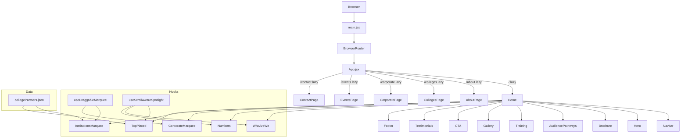

# Gryphon Academy Website — Project Wiki

> **Stack:** React 19 · Vite 7 · Tailwind CSS v4 · React Router v7 · AOS · FontAwesome
> **Type:** Multi-page marketing website (SPA with client-side routing)
> **Language:** JavaScript (JSX)
> **Last updated:** 2026-05-06

---

## Table of Contents

1. [Getting Started](#getting-started)
2. [Architecture](#architecture)
3. [Performance System](#performance-system)
4. [Pages](#pages)
5. [Components — Home](#components--home)
6. [Components — About](#components--about)
7. [Hooks](#hooks)
8. [Data Layer](#data-layer)
9. [Styling System](#styling-system)
10. [SEO](#seo)
11. [Quick Reference](#quick-reference)
12. [Glossary](#glossary)

---

## Getting Started

```bash
git clone <repo-url>
cd Gryphon-Academy-Website
npm install
npm run dev      # → http://localhost:5173
npm run build    # production bundle → dist/
npm run preview  # preview production build locally
npm run lint     # ESLint check
```

### Environment Variables

File: `.env` (not committed). Used for contact form endpoint if API integration is added.

---

## Architecture

### Core Pattern

This is a **page-composition SPA**. Every route maps to one page file that stacks standalone section components vertically. There is no global state — each component is self-contained.

### Routing — `src/App.jsx`

All routes are **lazily loaded** with `React.lazy` + `Suspense` (fallback `null`). This splits the JS bundle so each page chunk only loads when first visited.

```jsx
const Home        = lazy(() => import("./pages/Home"));
const CollegesPage  = lazy(() => import("./pages/CollegesPage"));
// ... etc
```

| Path | Page Component |
|---|---|
| `/` | `src/pages/Home.jsx` |
| `/about` | `src/pages/AboutPage.jsx` |
| `/colleges` | `src/pages/CollegesPage.jsx` |
| `/corporate` | `src/pages/CorporatePage.jsx` |
| `/events` | `src/pages/EventsPage.jsx` |
| `/contact` | `src/pages/ContactPage.jsx` |

### Component Layers

```
src/
├── main.jsx              ← Entry: mounts <App> inside <BrowserRouter>
├── App.jsx               ← Router: lazy <Route>s + <Suspense>
├── pages/                ← Page layer: assembles section components
│   ├── Home.jsx
│   ├── AboutPage.jsx
│   ├── CollegesPage.jsx
│   ├── CorporatePage.jsx
│   ├── EventsPage.jsx
│   └── ContactPage.jsx
├── components/
│   ├── home/             ← Section components for Home (and shared)
│   └── about/            ← Section components for AboutPage
├── hooks/                ← Reusable behaviour hooks
├── data/                 ← Static JSON data files
└── assets/               ← Images, logos, videos, SVGs
```

### System Diagram



### Design Tradeoffs

| Decision | Chosen | Alternative | Reason |
|---|---|---|---|
| State management | Local `useState`/`useRef` | Redux / Zustand | Site is mostly static; no cross-page state needed |
| Styling | Tailwind v4 + inline styles | CSS Modules | Rapid iteration on marketing copy |
| Routing | React Router v7 | Next.js | Pure CSR; no SSR needed |
| Bundle splitting | `React.lazy` per route | Single bundle | Reduces initial JS parse time |
| Animation | AOS + CSS transitions | Framer Motion | Simpler dependency |
| Data | Hardcoded JSON + inline arrays | CMS / API | Content is stable; no CMS budget at MVP |

---

## Performance System

Several layers work together to keep the site fast on low-end devices:

### 1. Route-level Code Splitting
Each page is a separate JS chunk. Only `Home` loads on first visit. (`src/App.jsx`)

### 2. `content-visibility: auto` — `.cv-auto`
Heavy off-screen sections in `Home.jsx` are wrapped in `<div className="cv-auto">`. The browser skips layout and paint for these until they scroll into view.

Sections wrapped: `AudiencePathways`, `Training`, `Numbers`, marquee band, `TopPlaced`, `Gallery`, `Testimonials`.

```css
/* src/index.css */
.cv-auto {
  content-visibility: auto;
  contain-intrinsic-size: auto 600px;
}
```

### 3. Marquee rAF Pause (off-screen)
`useDraggableMarquee` runs a `requestAnimationFrame` loop for smooth scrolling. Without optimisation, 6 loops run continuously even when the marquee is off-screen.

Fix: an `IntersectionObserver` inside the hook sets `isVisibleRef`. The rAF step skips all work when not visible — the single biggest CPU saving for low-end laptops.

### 4. Video Visibility Control
- **Hero video** (`herooo.mp4`) — pauses via scroll/visibility listener when hero leaves viewport. `preload="none"` prevents blocking initial page load.
- **Bridge video** (`Bridge.mp4` in AudiencePathways) — pauses via `IntersectionObserver` when off-screen. `preload="none"`.

### 5. GPU Layer Promotion
`.marquee-track` elements get `will-change: transform` + `backface-visibility: hidden`, promoting them to their own compositor layer so the main thread stays free.

### 6. `prefers-reduced-motion`
All CSS animations and transitions are instantly cut to `0.01ms` for users who have enabled reduced-motion in their OS. Improves accessibility and saves CPU.

### 7. Preconnect Hints
`index.html` includes `<link rel="preconnect">` for Cloudinary and Google Fonts so DNS/TCP is resolved before those assets are needed.

---

## Pages

### `Home.jsx` — `src/pages/Home.jsx`
Main landing page. Section order:
`Hero → WhoAreWe → Brochure → AudiencePathways → Training → Numbers → CorporateMarquee → InstitutionsMarquee → TopPlaced → Gallery → CTA → Testimonials → Footer`

**Key behaviours:**
- Navbar show/hide driven by scroll accumulation logic
- Sections below the fold wrapped in `.cv-auto` for deferred rendering
- No `window.scrollTo(0,0)` — scroll position managed by React Router

### `AboutPage.jsx`
Stack: `AboutHero → AboutNew → MissionVisionSection → AboutLeaders → AboutIntro → ImpactSection → AboutOffer → AboutGal → Testimonials → Footer`

### `CollegesPage.jsx`
Targeted at college decision-makers. Showcases partnership programme, placement stats, and CTAs.

### `CorporatePage.jsx`
Targeted at corporate HR/L&D teams. Showcases training offerings and client logos.

### `EventsPage.jsx`
Events listing. Content is hardcoded inline.

### `ContactPage.jsx`
Contact form + map/address. Largest page file (~20 KB) — includes form validation logic.

---

## Components — Home

### `Navbar.jsx`
**Props:** `isVisible` (bool) · `isFullWidth` (bool) · `logoSrc` (string)

- Scroll-aware show/hide animated via CSS `translate-y`/`opacity`
- Full-width mode when `WhoAreWe` section scrolls past top
- **Mobile hamburger menu** (added 2026-05-06):
  - Hamburger icon visible on `< md` breakpoints
  - Slide-in drawer from right with backdrop overlay
  - Body scroll locked while drawer is open
  - Closes on: link click · Escape key · backdrop click · route change
  - ARIA: `role="dialog"`, `aria-modal`, `aria-expanded`, `aria-controls`

### `Hero.jsx`
Full-viewport hero with background `herooo.mp4` video.

- Video pauses when hero leaves viewport (scroll + visibility listeners)
- `preload="none"` — video doesn't block initial page load
- Top-left logo (`<a href="/">`) shown when Navbar is hidden
- Cinematic gradient overlay (dark at bottom, light at top)
- **No CTA buttons** — removed by design decision (2026-05-06)

### `WhoAreWe.jsx`
Company intro with team image and "Learn More" button → `/contact`.

- Interactive spotlight grid pattern follows mouse position (`useScrollAwareSpotlight`)
- "Learn More" uses React Router `<Link to="/contact">` (not `#contact` anchor)

### `Brochure.jsx`
Brochure download CTA section.

- Both CTAs route to `/contact` (the brochure PDF was removed from repo)
- Uses React Router `<Link>` — not dead `href="#"` anchors

### `AudiencePathways.jsx`
Two-column service cards (For Corporates / For Colleges) with `Bridge.mp4` video header.

- Video pauses via `IntersectionObserver` when off-screen
- `preload="none"` on video

### `numbers.jsx`
Animated counter stats section. Uses `IntersectionObserver` to trigger count animation when section enters viewport.

Stats: 1,20,000+ students · 65,000+ training hours · 92% placement ratio · 27 LPA highest · 550+ hiring partners · 75+ college partners.

### `InstitutionsMarquee.jsx`
**Most complex component.** Three-row auto-scrolling marquee of college partner logos.

- Drag-to-scroll with momentum physics via `useDraggableMarquee`
- Windows-style hover tooltip (college name, category badge, location)
- Category badge colours mapped by type: IIT/NIT (blue) · BITS/VIT (purple) · Central University (green) · State University (amber) · Private (pink)
- rAF loop pauses when off-screen (via hook's `IntersectionObserver`)
- Layout constants defined as named module-level `const` variables

### `CorporateMarquee.jsx`
Three-row auto-scrolling marquee of recruiter/corporate logos. Mirrors `InstitutionsMarquee` structure. No tooltip.

### `TopPlaced.jsx`
Grid of top-placed students (photo, name, company, package). Uses `useScrollAwareSpotlight` for active card highlighting.

### `Testimonials.jsx`
Largest component (43 KB). Student/alumni testimonials carousel or masonry grid.

### `Training.jsx`
"How It Works" section — heading + full-width infographic image (`training.webp`).

### `CTA.jsx`
Call-to-action banner (dark blue). All three buttons use `<Link to="/contact">` — **not** `href="#contact"`.

### `Gallery.jsx`
5-card bento grid of event photos. Hover reveals description panel with curved border animation. Images load lazily.

### `Footer.jsx`
4-column footer: logo · useful links · contact details · social icons.

---

## Components — About

| Component | Description |
|---|---|
| `AboutHero.jsx` | Hero banner for About page |
| `AboutNew.jsx` | Short intro blurb |
| `MissionVisionSection.jsx` | Mission and Vision cards |
| `AboutLeaders.jsx` | Leadership team grid (~11 KB) |
| `AboutIntro.jsx` | Extended company story |
| `ImpactSection.jsx` | Animated impact metric counters |
| `AboutOffer.jsx` | "What we offer" service highlights |
| `AboutGal.jsx` | About-specific photo gallery (~12 KB) |
| `AboutAwards.jsx` | Awards and recognitions |
| `WaveElement.jsx` | Decorative SVG wave section divider |
| `AcrossIndia.jsx` | India map visualisation (`@aryanjsx/indiamap`) |
| `JourneySection.jsx` | Company milestone timeline |
| `ConnectWithUs.jsx` | Social/contact links (has own `ConnectWithUs.module.css`) |

---

## Hooks

### `useDraggableMarquee.js`
Adds **click-and-drag horizontal scroll with momentum** to a marquee container.

```js
const { trackRef, dragHandlers } = useDraggableMarquee({ reverse, speed, onDragStart });
// attach trackRef to the inner scrolling div
// spread dragHandlers onto the outer container
```

**Options:**
- `reverse` (bool) — scroll direction
- `speed` (string e.g. `"80s"`) — auto-scroll cycle duration
- `onDragStart` (fn) — called when drag begins (used to hide tooltip)

**Performance:** Contains an `IntersectionObserver` that pauses the rAF loop when the container is not visible. Critical for low-end device performance.

**Used by:** `InstitutionsMarquee.jsx`, `CorporateMarquee.jsx`

### `useScrollAwareSpotlight.js`
Tracks mouse position within a section to render a radial grid spotlight effect.

**Returns:** `{ sectionRef, spotlight, spotlightHandlers }`

**Used by:** `WhoAreWe.jsx`, `Numbers.jsx`, `TopPlaced.jsx`

---

## Data Layer

### `collegePartners.json` — `src/data/collegePartners.json`
Array of college partner objects:
```json
{ "id": 1, "name": "...", "imagePath": "../../assets/GA College Partners/...", "category": "IIT", "location": "Mumbai" }
```
**Consumed by:** `InstitutionsMarquee.jsx`, `TopPlaced.jsx`

All other data (testimonials, leader bios, stats, events) is **hardcoded inline** in each component.

---

## Styling System

| Layer | Mechanism | File |
|---|---|---|
| Global reset & fonts | Vanilla CSS | `src/index.css` |
| Utility classes | Tailwind CSS v4 | Applied inline in JSX |
| Performance utilities | Vanilla CSS (`.cv-auto`) | `src/index.css` |
| Component-scoped styles | CSS Modules (1 case) | `ConnectWithUs.module.css` |
| App-level overrides | Vanilla CSS | `src/App.css` |
| Animation (scroll reveal) | AOS library | Initialized in page `useEffect` |
| Animation (transitions) | CSS `transition` + Tailwind | Inline in components |
| Reduced-motion | `@media (prefers-reduced-motion)` | `src/index.css` |

**Key CSS classes in `src/index.css`:**
- `.cv-auto` — `content-visibility: auto` for off-screen sections
- `.marquee-track` — `will-change: transform`, `backface-visibility: hidden`
- `.partners-marquee-*` — marquee animation, fade masks, glass card styles
- `.testimonial-dots-bg` — diagonal line pattern for testimonials background

---

## SEO

`index.html` includes:
- `<title>` — "Gryphon Academy — Industry-Ready Training & Campus Placement"
- `<meta name="description">` — 160-char description with key stats
- `<meta name="keywords">` — relevant industry terms
- `<link rel="canonical">` — `https://gryphonacademy.co.in/`
- Open Graph tags (`og:title`, `og:description`, `og:image`, `og:type`)
- Twitter Card tags
- `<link rel="preconnect">` for Cloudinary and Google Fonts
- Favicon: `/favicon.png` (replace `vite.svg` with actual brand icon)

> ⚠️ **Note:** The favicon is still a placeholder. Replace `/public/favicon.png` with the actual Gryphon Academy icon.

---

## Quick Reference

| Task | File |
|---|---|
| Add / change a route | `src/App.jsx` |
| Edit navbar links | `src/components/home/Navbar.jsx` |
| Edit footer | `src/components/home/Footer.jsx` |
| Change hero headline | `src/components/home/Hero.jsx` |
| Add college logo | `src/data/collegePartners.json` + `src/assets/GA College Partners/` |
| Add recruiter logo | `src/assets/Recruiters/` |
| Edit global CSS | `src/index.css` |
| Edit Vite config | `vite.config.js` |
| Edit SEO / meta tags | `index.html` |
| Update favicon | `public/favicon.png` |

**Adding a new page:**
1. Create `src/pages/NewPage.jsx`
2. Add `const NewPage = lazy(() => import("./pages/NewPage"))` in `src/App.jsx`
3. Add `<Route path="/new" element={<NewPage />} />` inside `<Suspense>`
4. Add nav link in `src/components/home/Navbar.jsx`

**Adding a new section component:**
1. Create `src/components/home/MySection.jsx`
2. Import and render it in the relevant page file
3. Wrap in `<div className="cv-auto">` if it appears below the fold

---

## Glossary

| Term | Definition |
|---|---|
| SPA | Single-Page Application — one HTML file, JS handles routing |
| CSR | Client-Side Rendering — React renders in the browser |
| HMR | Hot Module Replacement — Vite reloads only changed modules during dev |
| `React.lazy` | Defers loading a component until it's first rendered |
| `Suspense` | Shows a fallback while a lazy component loads |
| `content-visibility` | CSS property that skips rendering off-screen elements |
| `IntersectionObserver` | Browser API that fires when an element enters/leaves the viewport |
| rAF | `requestAnimationFrame` — browser callback synced to display refresh rate |
| AOS | Animate On Scroll — triggers CSS animations when elements enter viewport |
| Marquee | Auto-scrolling horizontal strip of logos/cards |
| Drag-scroll | Click-and-drag to scroll a container horizontally |
| Spotlight | Mouse-following radial gradient grid overlay |
| Layout constants | Named `const` at module top for sizing classes (e.g. `LOGO_FRAME_SIZE_CLASS`) |
| `cv-auto` | Project utility class applying `content-visibility: auto` |
| CSS Module | Scoped `.module.css` file — class names are local to the component |
| `dist/` | Production build output (generated by `vite build`) |
| `.env` | Environment variables file (not committed to git) |
