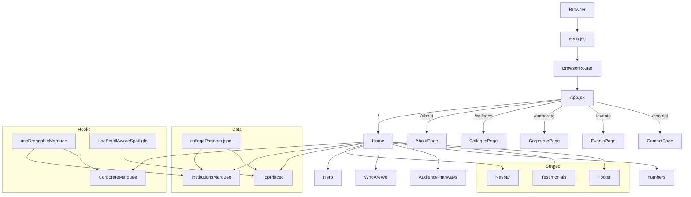

# Gryphon Academy Website — Project Wiki

> **Stack:** React 19 · Vite 7 · Tailwind CSS v4 · React Router v7 · AOS · FontAwesome  
> **Type:** Multi-page marketing website (SPA with client-side routing)  
> **Language:** JavaScript (JSX)

---

## Table of Contents

1. [Onboarding](#onboarding)
   - [Principal-Level Guide](#principal-level-guide)
   - [Zero-to-Hero Learning Path](#zero-to-hero-learning-path)
2. [Getting Started](#getting-started)
   - [Project Overview](#project-overview)
   - [Setup & Dev Server](#setup--dev-server)
   - [Environment Variables](#environment-variables)
   - [Quick Reference](#quick-reference)
3. [Architecture](#architecture)
   - [Routing](#routing)
   - [Page Composition Pattern](#page-composition-pattern)
   - [Component Layers](#component-layers)
4. [Pages](#pages)
5. [Components — Home](#components--home)
6. [Components — About](#components--about)
7. [Hooks](#hooks)
8. [Data Layer](#data-layer)
9. [Styling System](#styling-system)
10. [Glossary](#glossary)

---

## Onboarding

### Principal-Level Guide

#### Core Architectural Insight

This is a **page-composition SPA**. Every route maps to a single page file that assembles a vertical stack of standalone section components. There is no global state manager — each component is self-contained, fetching its own static data (from `src/data/`) or hardcoding it inline.

```python
# Pseudocode (Python) — how any page works
def render_page(route):
    scroll_to_top()
    return vertical_stack([
        Navbar(visible=scroll_aware),
        SectionA(),
        SectionB(),
        SectionC(),
        Footer(),
    ])
```

The equivalent in `src/pages/Home.jsx:1-80`.

#### System Architecture



#### Design Tradeoffs

| Decision | Chosen | Alternative | Reason |
|---|---|---|---|
| State management | Local `useState`/`useRef` | Redux / Zustand | Site is mostly static; no cross-page state needed |
| Styling | Tailwind v4 + inline styles | CSS Modules | Rapid iteration on marketing copy |
| Routing | React Router v7 | Next.js | Pure CSR; no SSR needed for this marketing site |
| Animation | AOS + CSS transitions | Framer Motion | Simpler dependency; sufficient for scroll reveals |
| Data | Hardcoded JSON + inline arrays | CMS / API | Content is stable; no CMS budget at MVP stage |

#### Where to Go Deep (Reading Order)

1. `src/main.jsx` — entry point, BrowserRouter setup
2. `src/App.jsx` — all routes defined here
3. `src/pages/Home.jsx` — canonical page composition pattern
4. `src/components/home/InstitutionsMarquee.jsx` — most complex component (draggable marquee + tooltip)
5. `src/hooks/useDraggableMarquee.js` — custom drag-scroll hook
6. `src/hooks/useScrollAwareSpotlight.js` — scroll-position-aware highlight hook

---

### Zero-to-Hero Learning Path

#### Part I — Technology Foundations

**React 19 (JSX)**
- Components are functions returning JSX
- `useState` for local UI state, `useEffect` for side effects, `useRef` for DOM refs
- React Compiler is enabled (`babel-plugin-react-compiler`) — avoids need for manual `useMemo`/`useCallback`
- Comparison (Python): a JSX component ≈ a Python function returning an HTML string, but reactive

**Vite 7**
- Dev server: `npm run dev` → hot module replacement
- Build: `npm run build` → output in `dist/`
- Config: `vite.config.js` — uses `@vitejs/plugin-react` with React Compiler Babel plugin

**Tailwind CSS v4**
- Utility-first CSS; classes like `flex`, `gap-4`, `text-xl` applied directly in JSX
- v4 uses a CSS-first config (`tailwind.config.js` is minimal)
- Custom spacing/colors set in `src/index.css`

**React Router v7**
- `<BrowserRouter>` wraps the app in `src/main.jsx`
- `<Routes>` + `<Route>` in `src/App.jsx` define all pages
- `useNavigate`, `<Link>` used inside Navbar for navigation

#### Part II — Codebase Architecture

**Page Pattern** (`src/pages/*.jsx`)  
Each page file:
1. Imports section components
2. Manages Navbar visibility via scroll listener
3. Calls `window.scrollTo(0,0)` on mount
4. Returns a `<div>` stacking all sections vertically

**Component Pattern** (`src/components/**/*.jsx`)  
Each component:
- Is fully self-contained (no props from parent pages, except Navbar)
- Manages its own animation state (AOS, CSS transitions)
- Sources data from `src/data/` or inline arrays

**Custom Hooks** (`src/hooks/`)
- `useDraggableMarquee` — adds click-and-drag scroll to a marquee container
- `useScrollAwareSpotlight` — tracks scroll position to highlight active items

#### Part III — Dev Setup, Testing & Contributing

**Setup**
```bash
npm install
npm run dev        # http://localhost:5173
npm run build      # production bundle → dist/
npm run preview    # preview production build locally
npm run lint       # ESLint check
```

**Adding a new page**
1. Create `src/pages/NewPage.jsx` (copy `Home.jsx` as template)
2. Add `<Route path="/new" element={<NewPage />} />` in `src/App.jsx:15`
3. Add a nav link in `src/components/home/Navbar.jsx`

**Adding a new section component**
1. Create `src/components/home/MySection.jsx` or `src/components/about/MySection.jsx`
2. Import and drop it into the relevant page file

**Modifying content data**
- College/institution logos and names: `src/data/collegePartners.json`
- Testimonials: hardcoded in `src/components/home/Testimonials.jsx`
- Leader profiles: hardcoded in `src/components/about/AboutLeaders.jsx`

---

## Getting Started

### Project Overview

Gryphon Academy is a training and placement company. This website is their multi-page marketing SPA with sections for:
- Home (hero, audience pathways, stats, partner institutions, top placements, testimonials)
- About (leadership, mission/vision, impact metrics, gallery)
- Colleges (college partnership programme)
- Corporate (corporate training offerings)
- Events (events listing)
- Contact (contact form)

### Setup & Dev Server

```bash
# Clone and install
git clone <repo-url>
cd Gryphon-Academy-Website
npm install

# Start dev server
npm run dev
# → http://localhost:5173
```

### Environment Variables

File: `.env` (not committed — copy from `.env.example` if present)

Currently used for:
- Contact form endpoint (if any API integration is present)

### Quick Reference

| Task | File |
|---|---|
| Add/change a route | `src/App.jsx` |
| Edit navbar links | `src/components/home/Navbar.jsx` |
| Edit footer | `src/components/home/Footer.jsx` |
| Change hero copy | `src/components/home/Hero.jsx` |
| Add college logo | `src/data/collegePartners.json` |
| Edit global CSS / fonts | `src/index.css` |
| Edit Vite config | `vite.config.js` |

---

## Architecture

### Routing

Defined in `src/App.jsx:14-21`.

| Path | Page Component |
|---|---|
| `/` | `src/pages/Home.jsx` |
| `/about` | `src/pages/AboutPage.jsx` |
| `/colleges` | `src/pages/CollegesPage.jsx` |
| `/corporate` | `src/pages/CorporatePage.jsx` |
| `/events` | `src/pages/EventsPage.jsx` |
| `/contact` | `src/pages/ContactPage.jsx` |

### Page Composition Pattern

Every page follows this structure:

```jsx
// src/pages/Home.jsx (representative)
export default function Home() {
  const [isNavbarVisible, setIsNavbarVisible] = useState(true);
  // scroll listener sets isNavbarVisible

  useEffect(() => { window.scrollTo(0, 0); }, []);

  return (
    <div className="min-h-screen w-full bg-white">
      <Navbar isVisible={isNavbarVisible} />
      <Hero />
      <SectionA />
      <SectionB />
      <Footer />
    </div>
  );
}
```

### Component Layers

```
src/
├── main.jsx              ← Entry: mounts <App> inside <BrowserRouter>
├── App.jsx               ← Router: defines all <Route>s
├── pages/                ← Page layer: assembles section components
│   ├── Home.jsx
│   ├── AboutPage.jsx
│   ├── CollegesPage.jsx
│   ├── CorporatePage.jsx
│   ├── EventsPage.jsx
│   └── ContactPage.jsx
├── components/
│   ├── home/             ← Section components used by Home (and shared)
│   └── about/            ← Section components used by AboutPage
├── hooks/                ← Reusable behaviour hooks
├── data/                 ← Static JSON data files
└── assets/               ← Images, logos, SVGs
```

---

## Pages

### `Home.jsx` — `src/pages/Home.jsx`
The main landing page. Composes the full marketing funnel: Hero → Audience targeting → Stats → Partner institutions → Top placed students → Corporate partners → Testimonials.

**Key behaviours:**
- Navbar hide/show on scroll via `useState` + scroll event listener
- AOS animation library initialized on mount (`AOS.init()`)
- Scroll-to-top on route mount

### `AboutPage.jsx` — `src/pages/AboutPage.jsx`
Company info page. Stack: `AboutHero → AboutNew → MissionVisionSection → AboutLeaders → AboutIntro → ImpactSection → AboutOffer → AboutGal → Testimonials → Footer`

### `CollegesPage.jsx` — `src/pages/CollegesPage.jsx`
Targeted at college decision-makers. Showcases college partnership programme, placement stats, and CTAs.

### `CorporatePage.jsx` — `src/pages/CorporatePage.jsx`
Targeted at corporate HR/L&D teams. Showcases training offerings and client logos.

### `EventsPage.jsx` — `src/pages/EventsPage.jsx`
Lists upcoming/past events. Content is currently hardcoded inline.

### `ContactPage.jsx` — `src/pages/ContactPage.jsx`
Contact form + map/address. Largest page file (20 KB) — likely includes form validation logic.

---

## Components — Home

### `Navbar.jsx` — `src/components/home/Navbar.jsx`
Shared navigation bar. Props: `isVisible` (bool), `isFullWidth` (bool), `logoSrc` (string).  
Handles scroll-aware show/hide passed down from the page.

### `Hero.jsx` — `src/components/home/Hero.jsx`
Full-width landing hero with headline, subtext, and CTA buttons.

### `WhoAreWe.jsx` — `src/components/home/WhoAreWe.jsx`
Brief company intro section with stats or tagline.

### `AudiencePathways.jsx` — `src/components/home/AudiencePathways.jsx`
Splits visitors into audience segments (Students / Colleges / Corporates) with pathway cards.

### `numbers.jsx` — `src/components/home/numbers.jsx`
Animated counter stats section (placements, partners, years, etc.).

### `InstitutionsMarquee.jsx` — `src/components/home/InstitutionsMarquee.jsx`
**Most complex component.** Auto-scrolling marquee of college partner logos with:
- Drag-to-scroll via `useDraggableMarquee` hook
- Windows-style hover tooltip (`Tooltip` sub-component, line 73)
- Dual tracks (forward + reverse scroll)
- Fade mask edges via CSS `mask-image`
- Layout constants defined as named variables (lines 62–70)

### `TopPlaced.jsx` — `src/components/home/TopPlaced.jsx`
Grid/carousel of top-placed students with photo, name, company, and package.  
Uses `useScrollAwareSpotlight` hook for active card highlighting.

### `CorporateMarquee.jsx` — `src/components/home/CorporateMarquee.jsx`
Auto-scrolling marquee of corporate client logos. Mirrors `InstitutionsMarquee` layout constants.

### `Testimonials.jsx` — `src/components/home/Testimonials.jsx`
Largest component (43 KB). Student/alumni testimonials — likely a carousel or masonry grid with rich content.

### `Training.jsx` — `src/components/home/Training.jsx`
Training programme highlights section.

### `Brochure.jsx` — `src/components/home/Brochure.jsx`
PDF brochure download CTA section.

### `CTA.jsx` — `src/components/home/CTA.jsx`
Generic call-to-action banner used at page bottoms.

### `Gallery.jsx` — `src/components/home/Gallery.jsx`
Photo gallery grid of events and campus activities.

### `Footer.jsx` — `src/components/home/Footer.jsx`
Shared site footer with links, social icons, and copyright.

---

## Components — About

### `AboutHero.jsx` — `src/components/about/AboutHero.jsx`
Hero banner for the About page.

### `AboutNew.jsx` — `src/components/about/AboutNew.jsx`
Small intro blurb (549 B — likely a short text block).

### `MissionVisionSection.jsx` — `src/components/about/MissionVisionSection.jsx`
Mission and Vision cards/blocks.

### `AboutLeaders.jsx` — `src/components/about/AboutLeaders.jsx`
Leadership team profiles — photos, names, bios. (~11 KB, likely a card grid.)

### `AboutIntro.jsx` — `src/components/about/AboutIntro.jsx`
Extended company story/intro text section.

### `ImpactSection.jsx` — `src/components/about/ImpactSection.jsx`
Key impact metrics (animated counters or stat cards).

### `AboutOffer.jsx` — `src/components/about/AboutOffer.jsx`
"What we offer" — service/programme highlights.

### `AboutGal.jsx` — `src/components/about/AboutGal.jsx`
About-specific photo gallery (~12 KB).

### `AboutAwards.jsx` — `src/components/about/AboutAwards.jsx`
Awards and recognitions section.

### `WaveElement.jsx` — `src/components/about/WaveElement.jsx`
Decorative SVG wave divider used between sections.

### `AcrossIndia.jsx` — `src/components/about/AcrossIndia.jsx`
India map visualization of presence (uses `@aryanjsx/indiamap`).

### `JourneySection.jsx` — `src/components/about/JourneySection.jsx`
Timeline of company milestones.

### `ConnectWithUs.jsx` — `src/components/about/ConnectWithUs.jsx`
Social media / contact links block (has its own CSS module: `ConnectWithUs.module.css`).

---

## Hooks

### `useDraggableMarquee.js` — `src/hooks/useDraggableMarquee.js`
Adds **click-and-drag horizontal scroll** behaviour to a container ref.

**API:**
```js
const { ref, isDragging } = useDraggableMarquee();
// attach ref to the scrollable container element
```

**Used by:** `InstitutionsMarquee.jsx`, `CorporateMarquee.jsx`

### `useScrollAwareSpotlight.js` — `src/hooks/useScrollAwareSpotlight.js`
Tracks the user's vertical scroll position to determine which item in a list should be "spotlighted" (active/highlighted).

**Used by:** `TopPlaced.jsx`

---

## Data Layer

### `collegePartners.json` — `src/data/collegePartners.json`
Array of college partner objects. Each entry likely contains:
- `name` — College name
- `logo` — Logo image path/URL
- `location` — City/state

**Consumed by:** `InstitutionsMarquee.jsx`, `TopPlaced.jsx`

All other data (testimonials, leader bios, stats, events) is **hardcoded inline** within each component.

---

## Styling System

| Layer | Mechanism | File |
|---|---|---|
| Global reset & fonts | Vanilla CSS | `src/index.css` |
| Utility classes | Tailwind CSS v4 | Applied inline in JSX |
| Component-scoped styles | CSS Modules (1 case) | `ConnectWithUs.module.css` |
| App-level overrides | Vanilla CSS | `src/App.css` |
| Animation (scroll reveal) | AOS library | Initialized in page `useEffect` |
| Animation (transitions) | CSS `transition` + Tailwind | Inline in components |

**Typography:**  
- Primary: `Roboto` (class `roboto-regular` on root `<div>`)  
- Loaded via Google Fonts in `src/index.css`

---

## Glossary

| Term | Definition |
|---|---|
| SPA | Single-Page Application — one HTML file, JS handles routing |
| CSR | Client-Side Rendering — React renders in the browser, not on a server |
| HMR | Hot Module Replacement — Vite reloads only changed modules during dev |
| AOS | Animate On Scroll — library that triggers CSS animations when elements enter viewport |
| Marquee | Auto-scrolling horizontal strip of logos/cards |
| Drag-scroll | Click-and-drag to scroll a container horizontally |
| Spotlight | Visual highlight applied to the "current" card based on scroll position |
| Route | A URL path mapped to a React page component |
| JSX | JavaScript XML — React's syntax extension that looks like HTML |
| Tailwind v4 | CSS-first version of Tailwind; no `@apply` needed, config is minimal |
| CSS Module | Scoped CSS file (`.module.css`) — class names are local to the component |
| `useEffect` | React hook for side effects (scroll listeners, AOS init, fetch calls) |
| `useRef` | React hook for a mutable ref to a DOM element |
| `useState` | React hook for local component state |
| Layout constants | Named `const` variables at module top for sizing classes (e.g. `LOGO_FRAME_SIZE_CLASS`) |
| FontAwesome | Icon library (`@fortawesome/react-fontawesome`) used for UI icons |
| BrowserRouter | React Router component that enables client-side routing via the History API |
| `dist/` | Production build output folder (generated by `vite build`) |
| `.env` | Environment variables file (not committed to git) |
